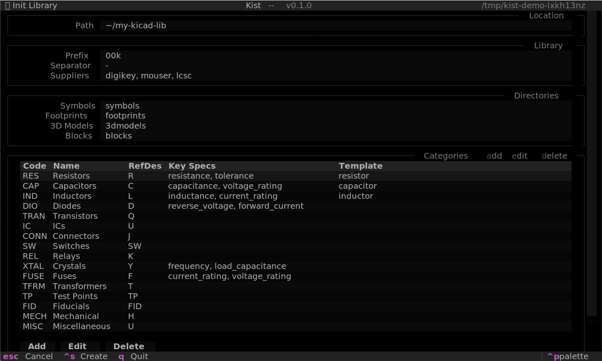
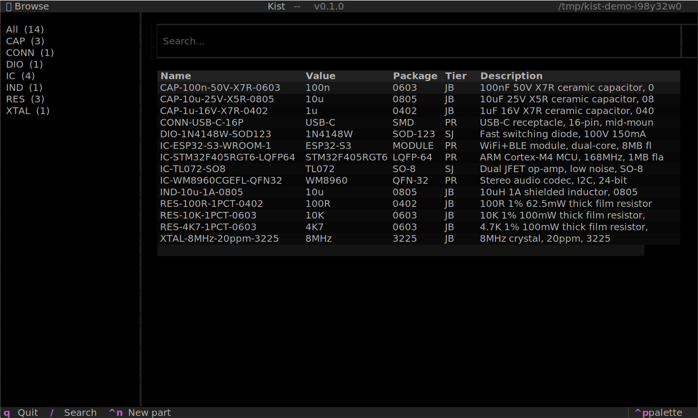
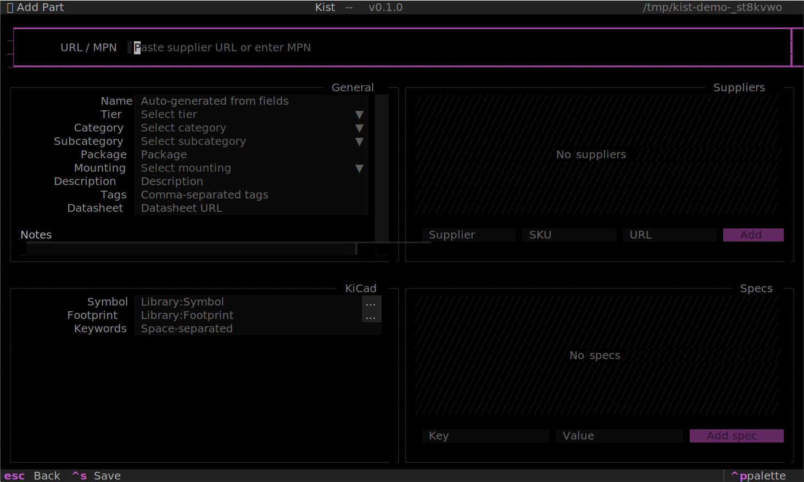
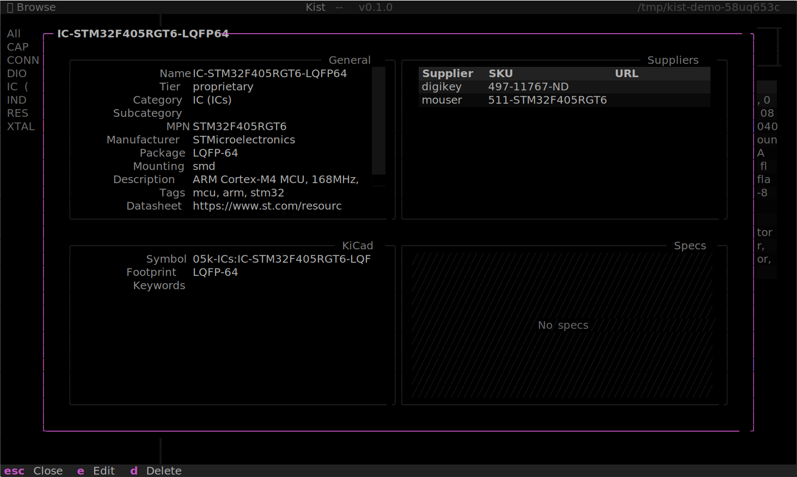

# Getting Started

## Install

Requires Python 3.12+.

```bash
# With Nix flakes
nix profile install github:skwort/kist

# With uv
uv tool install kist

# With pipx
pipx install kist
```

Or from source:

```bash
git clone https://github.com/skwort/kist.git
cd kist
uv sync
```

## Create a library

```bash
kist init -p ~/my-kicad-lib
```

This opens the init wizard with the path pre-filled. Configure the
naming prefix, suppliers, and directory layout, then press ++ctrl+s++
to create the library.



Use `--no-tui` to skip the wizard and create the library with
defaults:

```bash
kist init -p ~/my-kicad-lib --no-tui
```

This creates a `.kist/config.toml`, a `parts.json` database, and asset
directories for symbols, footprints, 3D models, and blocks.

## Link a KiCad project

```bash
cd ~/my-kicad-project
kist link ~/my-kicad-lib
```

This writes a `kist.toml` reference and creates a `lib/` symlink
so KiCad can find your symbols via `${KIPRJMOD}/lib/`.

## Launch the TUI

```bash
kist
```

Running `kist` without a subcommand opens the interactive TUI.
From there you can browse your library, search for parts, and add
new ones.



## Add a part

From the TUI, press ++ctrl+n++ to open the add screen. Paste a
DigiKey URL or MPN into the input bar and press ++enter++ -- kist
fetches the metadata, populates the form, and lets you review
before saving.

Fetching from DigiKey requires API credentials. Set them in the
TUI settings (++ctrl+comma++) or in your
[global config](configuration.md#global-config).



The symbol and footprint fields open a search modal where you can browse
your installed KiCad libraries with a live preview. Select an entry to
assign it, or press ++c++ to clone it into your local library.

Or from the CLI:

```bash
kist add https://www.digikey.com/en/products/detail/...
```

## View part details

Select a part from the browse screen and press ++enter++ to open the
detail modal. From here you can view all metadata, edit fields, or
delete the part.



## Next steps

- Read [Concepts](concepts.md) to understand the three-tier part model and library structure.
- See [Configuration](configuration.md) for config file reference.
- See [CLI Reference](cli.md) for all available commands.
